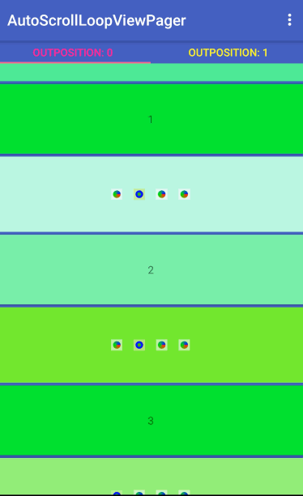

[](http://www.android-gems.com/lib/BoBoMEe/AutoScrollLoopViewPager)

# ScrollLoopViewPager

Android auto scroll viewpager or viewpager in viewpager

1. Trinea/[AutoScrollViewPager](https://github.com/Trinea/android-auto-scroll-view-pager)

- ViewPager which can auto scroll, cycle.

- ViewPager which can be slided normal in parent ViewPager.


2. yanzm/[LoopViewPager](https://github.com/yanzm/LoopViewPager)

An android ViewPager extension allowing infinite scrolling.

we can get the real position:

`int  position = (CONTENT.length + position%CONTENT.length)%CONTENT.length; `

The only thing you need to know that the position is not real position.

For example, is the data size if 4, and the page limit is 1, and the four pa . * 
at first, the index [-1, 0, 1] page will create * after fliping left 3 pages, the index [2, 3, 4] page will create. * real postion should be mapping `realPosition = (count + position%count) % count`, so index -1 will create the fourth page, and index 4 will create first page.


## ScreenShot




## Usage

- include this library, use

``` xml
<com.bobomee.android.scrollloopviewpager.autoscrollviewpager.AutoScrollViewPager
        android:id="@+id/vp"
        android:layout_width="match_parent"
        android:layout_height="wrap_content" />
```

replace

``` xml
<android.support.v4.view.ViewPager
	android:id="@+id/vp"
	android:layout_width="match_parent"
	android:layout_height="wrap_content" />
```

- `startAutoScroll()` start auto scroll, delay time is `getInterval()`.
- `startAutoScroll(int)` start auto scroll delayed.
- `stopAutoScroll()` stop auto scroll.

See:
[BannerViewActivity.java](https://github.com/BoBoMEe/AutoScrollLoopViewPager/blob/master/app/src/main/java/com/bobomee/android/autoscrollloopviewpager/MainActivity.java)


## Setting

- `setInterval(long)` set auto scroll time in milliseconds, default is `DEFAULT_INTERVAL`.
- `setDirection(int)` set auto scroll direction, default is `RIGHT`.
- `setScrollDurationFactor(double)` set the factor by which the duration of sliding animation will change.
- `setStopScrollWhenTouch(boolean)` set whether stop auto scroll when touching, default is true.
- You may need [ViewPagerIndicator](https://github.com/JakeWharton/Android-ViewPagerIndicator) to implement indicator. 
- Also you can see [DrawableIndicator](https://github.com/BoBoMEe/DrawableIndicator)

## Thanks

*   [imbryk/LoopingViewPager](https://github.com/imbryk/LoopingViewPager)
*   [Trinea/android-auto-scroll-view-pager](https://github.com/Trinea/android-auto-scroll-view-pager)


